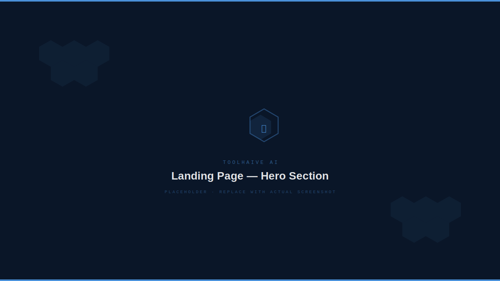
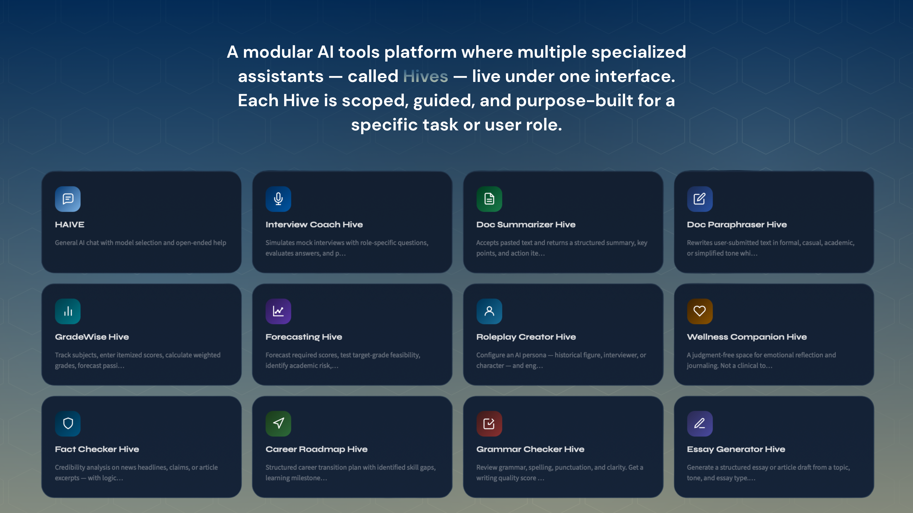
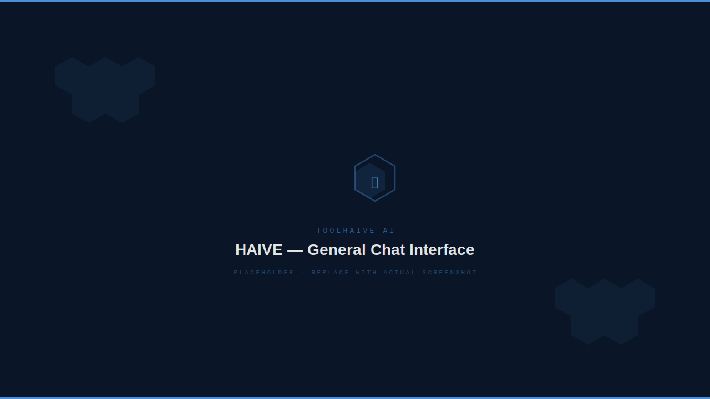
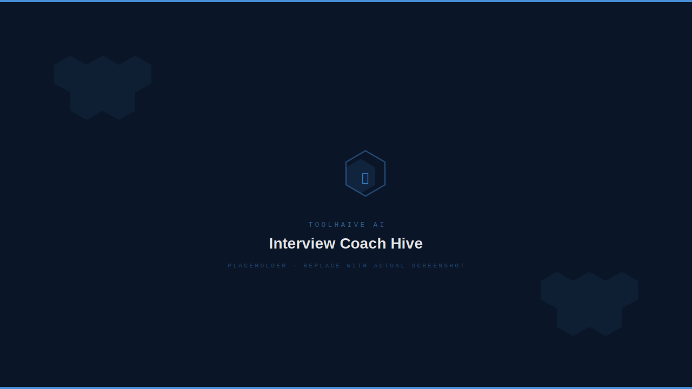
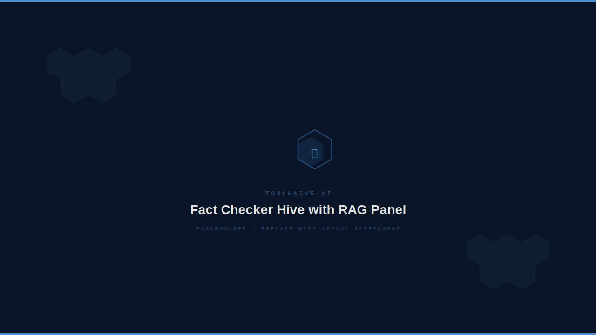
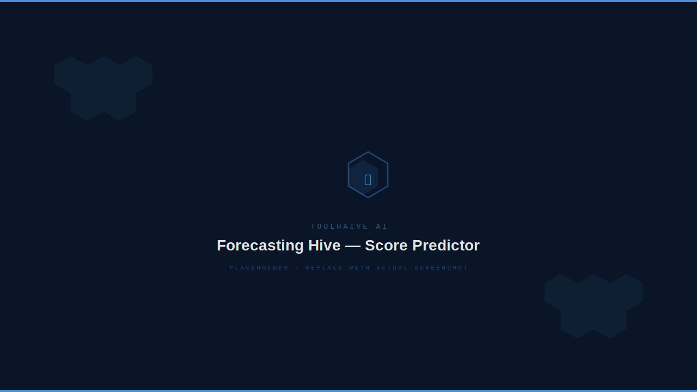
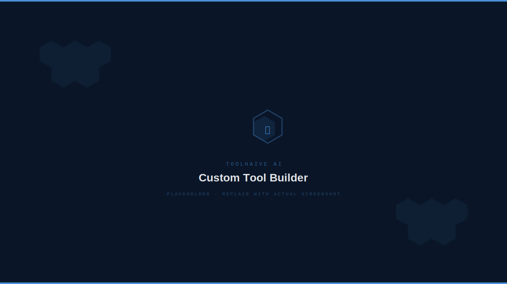
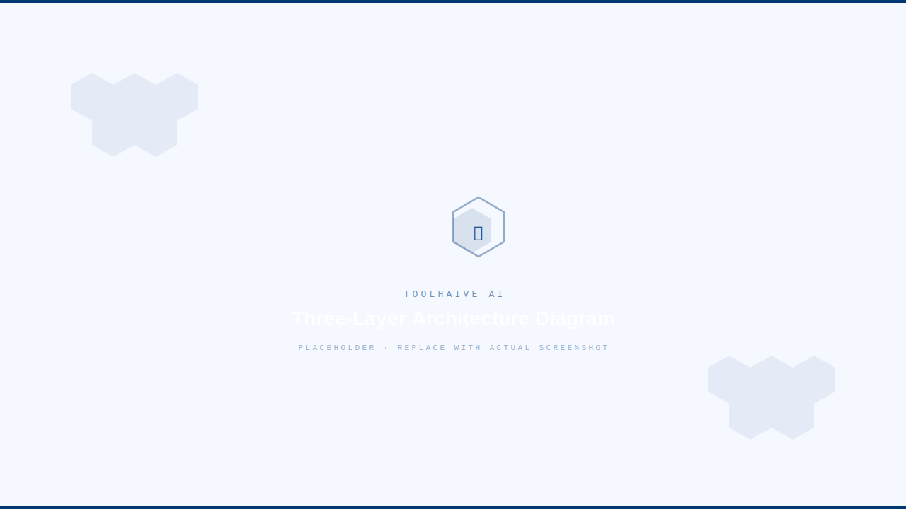

<div align="center">


# ToolHaive AI

**A Modular, Prompt-Engineered Generative AI Platform**

[](https://www.python.org/)
[](https://streamlit.io)
[](https://ollama.com)
[](https://www.trychroma.com/)
[](LICENSE)
[](#)

*From general chatbot to specialized assistant — one Hive at a time.*

</div>

---

## Table of Contents

1. [Overview](#overview)
2. [Background & Motivation](#background--motivation)
3. [What is a Hive?](#what-is-a-hive)
4. [Screenshots](#screenshots)
5. [Built-in Hives](#built-in-hives)
6. [Architecture](#architecture)
7. [Prompt Engineering Strategy](#prompt-engineering-strategy)
8. [RAG Engine](#rag-engine)
9. [Tech Stack](#tech-stack)
10. [Project Structure](#project-structure)
11. [Prerequisites](#prerequisites)
12. [Installation](#installation)
13. [Running the App](#running-the-app)
14. [Custom Tool Builder](#custom-tool-builder)
15. [Data Models](#data-models)
16. [Roadmap](#roadmap)
17. [Scope & Limitations](#scope--limitations)
18. [License](#license)

---

## Overview

<div align="center">
  
  <br/>
  <sub><i>Landing page — hero section</i></sub>
</div>

<br/>

**ToolHaive AI** is a modular Generative AI tools platform built with Python and Streamlit, powered by locally hosted large language models via [Ollama](https://ollama.com). Rather than a single general-purpose chatbot, the platform organizes AI capabilities into focused, task-specific assistants called **Hives** — each purpose-built for a specific user role or workflow.

The platform ships with **12 specialized Hives** plus **HAIVE**, a general-purpose open chat assistant. Users can discover, launch, and interact with any Hive, or create entirely new tools using the no-code **Custom Tool Builder** — all without writing a single line of code.

All AI inference runs locally via Ollama. No cloud API is required during runtime, keeping user data fully private and the platform accessible without internet connectivity once set up.

> **Capstone Project** — openIT Data Science Bootcamp · Manuel S. Enverga University Foundation, Lucena

---

## Background & Motivation

<div align="center">
  
  <br/>
  <sub><i>Tools Library dashboard — searchable, filterable Hive cards</i></sub>
</div>

<br/>

The rapid adoption of generative AI in the Philippines and globally has created both significant opportunity and a critical usability gap:

- **46%** of Filipino workers use AI tools at least once a month, surpassing the global average of 39% *(JobStreet by SEEK, 2024)*
- **12.7 million** Philippine workers are exposed to generative AI — the highest rate among ASEAN countries *(ILO, 2026)*
- Despite high adoption, maturity remains low: most users rely on general chatbots for content tasks rather than role-specific, productivity-driving workflows *(PhilSTAR Life, 2026)*

The core problem: **the AI exists, but the ability to use it well doesn't.** General-purpose chatbots produce unfocused, inconsistent outputs when approached with specific professional tasks — because users are expected to craft detailed prompts themselves, a skill most have not yet developed.

ToolHaive AI addresses this by packaging diverse AI workflows into guided, task-specific Hives. Each Hive handles the prompt complexity internally, so the user interacts with a structured interface, not a raw prompt box. This is aligned with the goals of the DTI's [National AI Strategy Roadmap (NAISR) 2.0](https://dict.gov.ph/) (2024) and the broader push toward practical, accessible AI adoption in the Philippines.

---

## What is a Hive?

A **Hive** is a specialized AI assistant scoped to a single task or domain. Every Hive has:

| Property | Description |
|---|---|
| **Purpose** | A clearly defined task it is built for |
| **Target user** | The specific role the Hive addresses |
| **Guided input** | A structured form or prompt interface (not a raw text box) |
| **Scoped system prompt** | Internal prompt engineering that constrains and focuses the AI |
| **Formatted output** | Responses tailored to the Hive's task — not generic paragraphs |

Hives are either **single-turn** (one input → one structured output) or **multi-turn** (persistent conversation with memory). All Hives share the same underlying Ollama inference client and are constrained by a shared scope boundary that prevents out-of-task drift.

---

## Screenshots

<div align="center">

| HAIVE — General Chat | Interview Coach Hive |
|---|---|
|  |  |

| GradeWise — Analytics Dashboard | Fact Checker with RAG |
|---|---|
|  |  |

| Forecasting Hive | Custom Tool Builder |
|---|---|
|  |  |

</div>

> **Note:** All screenshots above are placeholders. Replace with actual application screenshots at `assets/HAIVE-1.svg` through `assets/HAIVE-8.svg`.

---

## Built-in Hives

<div align="center">

| # | Hive | Category | Mode | Target User |
|---|---|---|---|---|
| — | **HAIVE** | General | Multi-turn | All users |
| 1 | **Interview Coach Hive** | Professional | Multi-turn | Job applicants & professionals |
| 2 | **Doc Summarizer Hive** | Academic | Single-turn | Students & researchers |
| 3 | **Doc Paraphraser Hive** | Academic | Single-turn | Students & writers |
| 4 | **GradeWise Hive** | Academic | Multi-turn | Students |
| 5 | **Forecasting Hive** | Academic | Multi-turn | Students & planners |
| 6 | **Roleplay Creator Hive** | Education | Multi-turn | Educators & trainers |
| 7 | **Wellness Companion Hive** | Wellness | Multi-turn | General users |
| 8 | **Fact Checker Hive** ⬡ RAG | Media Literacy | Single-turn | General users |
| 9 | **Career Roadmap Hive** | Professional | Single-turn | Professionals |
| 10 | **Grammar Checker Hive** | Academic | Single-turn | Students & writers |
| 11 | **Essay Generator Hive** | Academic | Single-turn | Students & content creators |
| 12 | **Quiz & Flashcard Generator Hive** | Education | Single-turn | Students & educators |

</div>

### Hive Descriptions

**HAIVE** — Open-ended general chat assistant with model selection. No scope constraints. Supports drafting, studying, brainstorming, planning, and general problem-solving. Available models: `phi4-mini` (default), `llama3.2`.

**Interview Coach Hive** — Simulates mock interviews with role-specific questions. Evaluates answers on clarity, relevance, and depth, and returns structured improvement suggestions before proceeding to the next question.

**Doc Summarizer Hive** — Accepts pasted text and returns a structured summary, key bullet-point takeaways, and action items. Optimized for academic and professional documents.

**Doc Paraphraser Hive** — Rewrites user-submitted text in a selected tone — Formal, Casual, Academic, or Simplified — while fully preserving original meaning. Displays original and paraphrased versions side by side.

**GradeWise Hive** — A self-contained academic tracker. Features: subject management, configurable passing grades, term weight settings (Prelims 20% / Midterm 20% / Semi-Finals 25% / Finals 35%), itemized score entry, weighted grade computation, required score forecasting, passing probability estimation, risk-level labeling, GWA equivalent display, dashboard analytics, radar charts, and risk maps.

**Forecasting Hive** — Standalone academic forecasting assistant. Accepts current grade, completed weight, passing grade, target grade, and recent trend. Returns required remaining average, passing probability, and an AI-generated action plan. Can optionally consume GradeWise session data as context.

**Roleplay Creator Hive** — Dynamically constructs an AI persona from user-defined settings (name, role, background, behavioral tone). The model remains fully in-character for the duration of the session.

**Wellness Companion Hive** — A judgment-free space for emotional reflection and journaling. Explicitly non-clinical: does not diagnose or simulate therapy. Responds empathetically and redirects to professional support when serious distress is detected.

**Fact Checker Hive** *(RAG-enabled)* — Credibility analysis on news headlines, claims, or article excerpts. Users may load reference documents into a local ChromaDB knowledge base before submitting a claim. Retrieved chunks are injected into the system prompt to ground the AI's analysis. Returns a structured credibility assessment: `Likely Reliable`, `Unclear`, or `Likely Misleading`, with reasoning, identified red flags, and a verification checklist.

**Career Roadmap Hive** — Accepts current role, existing skills, and a target career goal. Returns a structured roadmap with identified skill gaps, 30/60/90-day milestones, and prioritized learning resources.

**Grammar Checker Hive** — Reviews pasted text for grammar, spelling, punctuation, clarity, and overall writing quality. Returns corrections with brief explanations.

**Essay Generator Hive** — Generates a structured essay draft from topic, essay type (Argumentative / Expository / Analytical / Reflective / Compare & Contrast / Blog Post), tone, and approximate target length. Users may optionally paste reference notes for the AI to draw from.

**Quiz & Flashcard Generator Hive** — Creates quizzes with answer keys or flashcard sets from user-submitted notes or source text.

---

## Architecture

<div align="center">
  
  <br/>
  <sub><i>Three-layer architecture: Landing → Tools Library → Individual Hives</i></sub>
</div>

<br/>

ToolHaive AI uses a modular three-layer architecture:

```
Layer 1 — Landing Page          app.py
                                    Branded entry point. Introduces the platform,
                                    previews available Hives, routes to Tools Library.

Layer 2 — Tools Library         pages/0_Tools_Library.py
                                    Central navigation hub. Loads built-in tools from
                                    utils/tools_data.py and custom tools from
                                    data/custom_tools.json. Renders filterable Hive cards.

Layer 3 — Individual Hives      pages/[1–13]_*.py  +  pages/haive.py
                                    Each Hive is a dedicated Streamlit module with
                                    isolated logic, UI, and output layout.
                                    Prompt engineering is handled internally.
```

### Shared Infrastructure

```
utils/
├── ollama_client.py    Shared Ollama API wrapper — all Hives call this
├── tools_data.py       Single source of truth for all built-in Hive definitions
├── utils_rag.py        RAG engine — ChromaDB + nomic-embed-text
├── ui.py               CSS design system, navbar, tool header renderers
└── __init__.py

prompts/
└── tool_scope.txt      Shared scope boundary template — constrains every Hive
```

### AI Inference Flow

```
User Input
    │
    ▼
Individual Hive Page
    │  builds structured messages[]
    │  (system prompt = scoped_system_prompt() from ollama_client.py)
    ▼
utils/ollama_client.py → chat()
    │  POST localhost:11434/api/chat
    │  model: phi4-mini (default) or llama3.2
    ▼
Ollama (local LLM runtime)
    │
    ▼
Formatted response rendered in Hive UI
```

For RAG-enabled Hives, the flow extends:

```
User uploads reference text
    │
    ▼
utils_rag.py → ingest_text()
    │  chunk → embed (nomic-embed-text) → store in ChromaDB
    ▼
User submits query
    │
    ▼
utils_rag.py → retrieve()
    │  embed query → similarity search → top-K chunks
    ▼
Chunks injected into system prompt → chat()
```

---

## Prompt Engineering Strategy

Since ToolHaive AI does not implement model fine-tuning, **prompt engineering is the primary AI customization mechanism**. Four strategies are applied across all Hives:

### 1. Role Assignment
Each Hive's system prompt assigns the AI a professional identity. The Interview Coach acts as a domain-specific interviewer. The Wellness Companion is configured as a non-clinical emotional support companion. The Fact Checker is framed as a credibility analyst. Role assignment narrows the model's response space and aligns output style to the Hive's intended purpose.

### 2. Output Format Specification
Hives that require structured outputs include explicit format instructions in their system prompts. The Doc Summarizer returns bullet-format key points. The Career Roadmap Hive returns labeled milestones. The Fact Checker returns a structured credibility verdict with reasoning. This ensures outputs are immediately usable without post-processing.

### 3. Shared Scope Boundary
All Hives are wrapped inside a shared scope template (`prompts/tool_scope.txt`). This boundary layer prevents any Hive from drifting into open-ended general chat. If a user asks the Interview Coach about unrelated topics, the scoped prompt constrains the response to redirect back to the tool's purpose. **HAIVE is the only Hive exempt from this constraint.**

```
prompts/tool_scope.txt
─────────────────────────────────────────────────────────
You are operating inside {tool_name}, a specialized ToolHaive AI tool.

Tool scope:
{tool_scope}

Boundary rules:
- Help only with requests that fit this tool's purpose.
- If a request mixes in-scope and out-of-scope parts, answer only the in-scope part.
- Do not fabricate tool outputs, facts, sources, or missing user-provided data.
- If the request is outside this tool's purpose, respond exactly:
{refusal_message}

Tool-specific instructions:
{tool_prompt}
```

### 4. Tone and Behavioral Control
Several Hives require specific tonal registers. The Wellness Companion responds empathetically and avoids prescriptive language. The Doc Paraphraser accepts a user-selected tone and passes it as a prompt variable, dynamically adjusting the AI's rewriting style per request.

---

## RAG Engine

The Fact Checker Hive integrates ToolHaive's local Retrieval-Augmented Generation engine, implemented in `utils/utils_rag.py`.

**Components:**

| Component | Details |
|---|---|
| Vector store | ChromaDB (`PersistentClient`) at `data/chroma_db/` |
| Embedding model | `nomic-embed-text` via Ollama at `localhost:11434/api/embeddings` |
| Chunking | 500-character chunks, 50-character overlap |

**Public API:**

```python
from utils.utils_rag import ingest_text, ingest_file, retrieve, collection_exists

# Ingest reference text into a named collection
ingest_text("fact_checker", document_text, doc_id="doc1")

# Retrieve top-K most relevant chunks for a query
context = retrieve("fact_checker", user_query, top_k=3)

# Check if a collection has ingested documents
exists = collection_exists("fact_checker")
```

**RAG Workflow in the Fact Checker Hive:**

```
1. User pastes reference material → "Add to knowledge base"
         ↓
   ingest_text() → chunk → embed (nomic-embed-text) → store in ChromaDB

2. User submits a claim
         ↓
   retrieve() → embed query → similarity search → top-3 chunks returned
         ↓
   Chunks appended to system prompt under "Retrieved reference context" block
         ↓
   AI cross-references claim against user-provided sources

3. If no documents ingested → falls back to standard linguistic analysis
```

The RAG engine is tool-agnostic: any Hive can call `ingest_text()` and `retrieve()` with its own collection name. The Fact Checker Hive is the first integration; the architecture supports extension to additional Hives in future iterations.

---

## Tech Stack

| Layer | Technology |
|---|---|
| **Language** | Python 3.10+ (developed on 3.12) |
| **Web Framework** | Streamlit (multi-page, session state) |
| **LLM Runtime** | Ollama (local inference, REST API at `localhost:11434`) |
| **Default Model** | `phi4-mini` |
| **Secondary Model** | `llama3.2` (available via HAIVE) |
| **Embedding Model** | `nomic-embed-text` (RAG) |
| **Vector Store** | ChromaDB (local persistent, `data/chroma_db/`) |
| **HTTP Client** | `requests` |
| **Data Visualization** | Plotly (GradeWise analytics) |
| **UI / Styling** | Custom CSS injected via `utils/ui.py` |
| **Custom Tool Storage** | JSON (`data/custom_tools.json`) |
| **State Management** | Streamlit `st.session_state` |

### Model Registry

| Model | Status | Access |
|---|---|---|
| `phi4-mini` | ✅ Available (default) | All Hives |
| `llama3.2` | ✅ Available | HAIVE only |
| `gemma3:4b` | 🔜 TBA | — |
| `qwen3.5` | 🔜 TBA | — |
| `claude-3-5-sonnet` | 🔜 TBA | — |
| `gemini-2.0-flash` | 🔜 TBA | — |

---

## Project Structure

```
ToolHaive/
├── app.py                          # Landing page — branded entry point
│
├── pages/
│   ├── 0_Tools_Library.py         # Tools Library dashboard (search + filters)
│   ├── 1_Interview_Coach.py
│   ├── 2_Document_Summarizer.py
│   ├── 3_Document_Paraphraser.py
│   ├── 4_Grade_Predictor.py       # GradeWise Hive
│   ├── 5_Roleplay_Creator.py
│   ├── 6_Wellness_Companion.py
│   ├── 7_Fact_Checker.py          # RAG-enabled
│   ├── 8_Career_Roadmap.py
│   ├── 9_Custom_Tool_Runner.py    # Executes user-created Hives
│   ├── 10_Grammar_Checker.py
│   ├── 11_Essay_Generator.py
│   ├── 12_Quiz_Flashcard_Generator.py
│   ├── 13_Forecasting.py
│   ├── haive.py                   # HAIVE — general chat assistant
│   ├── about.py
│   └── sources.py                 # References page
│
├── utils/
│   ├── __init__.py
│   ├── ollama_client.py           # Shared Ollama API wrapper + model registry
│   ├── tools_data.py              # Single source of truth for BUILTIN_TOOLS
│   ├── utils_rag.py               # RAG engine (ChromaDB + nomic-embed-text)
│   └── ui.py                      # CSS design system + UI component renderers
│
├── prompts/
│   └── tool_scope.txt             # Shared scope boundary template
│
├── data/
│   ├── custom_tools.json          # User-created Hive definitions (persistent)
│   └── chroma_db/                 # ChromaDB vector store (auto-created, gitignored)
│
├── docs/
│   ├── paper.pdf                  # Full capstone research paper
│   ├── paper.docx
│   └── brand_guide.html           # Visual identity / brand guide
│
├── requirements.txt
└── .gitignore
```

---

## Prerequisites

- **Python 3.10 or higher** (developed on 3.12)
- **[Ollama](https://ollama.com)** installed and running
- **phi4-mini** pulled via Ollama CLI (required for all Hives)
- **llama3.2** pulled via Ollama CLI (optional, for HAIVE model selection)
- **nomic-embed-text** pulled via Ollama CLI (required only for RAG / Fact Checker Hive)

---

## Installation

### 1. Clone the repository

```bash
git clone https://github.com/your-username/toolhaive-ai.git
cd toolhaive-ai
```

### 2. Create and activate a virtual environment

```bash
# macOS / Linux
python -m venv .venv
source .venv/bin/activate

# Windows
python -m venv .venv
.venv\Scripts\activate
```

### 3. Install Python dependencies

```bash
pip install -r requirements.txt
```

`requirements.txt`:

```
streamlit
requests
plotly
chromadb
```

### 4. Install Ollama

Download and install Ollama from [ollama.com](https://ollama.com), then start the Ollama server:

```bash
ollama serve
```

### 5. Pull required models

```bash
# Required — default model used by all Hives
ollama pull phi4-mini

# Optional — secondary model available in HAIVE
ollama pull llama3.2

# Required only if using RAG features (Fact Checker Hive)
ollama pull nomic-embed-text
```

---

## Running the App

With Ollama running in a separate terminal (`ollama serve`), start the Streamlit app from the project root:

```bash
streamlit run app.py
```

The app will be available at `http://localhost:8501`.

### Verify Ollama is reachable

ToolHaive AI checks Ollama health via the `/api/tags` endpoint at startup. If Ollama is not running, tool pages will display a warning:

```
⚠️ Could not connect to Ollama. Make sure Ollama is running (`ollama serve`)
and phi4-mini is pulled (`ollama pull phi4-mini`).
```

---

## Custom Tool Builder

ToolHaive AI includes a no-code interface for creating and publishing new Hives without modifying application code.

To create a custom Hive, open the **Tools Library** and click **Add New Toolkit**. Fill in the following fields:

| Field | Description |
|---|---|
| **Tool Name** | Display name shown in the Tools Library |
| **Description** | Short description for the Hive card |
| **Target User** | Who this Hive is designed for |
| **Category** | `academic`, `professional`, `education`, `wellness`, `media`, or custom |
| **System Prompt** | The AI's role, behavior, and output format instructions |
| **Input Placeholder** | Hint text shown in the input field |
| **Output Format Instruction** | How the AI should structure its response |

Custom tools are saved to `data/custom_tools.json` and appear immediately in the Tools Library. They are executed by `pages/9_Custom_Tool_Runner.py` through the same Ollama client used by all built-in Hives.

Example custom tool entry:

```json
{
  "id": "apa_citation_machine",
  "name": "APA Citation Machine",
  "desc": "Generates APA 7th edition citations from article metadata, URLs, books, and journals.",
  "user": "Students, researchers, thesis writers, and academic staff",
  "cat": "academic",
  "cat_label": "Academic",
  "turn": "single",
  "system_prompt": "You are an APA 7th Edition Citation Generator. Your job is to format APA citations using ONLY the information provided by the user. Never invent authors, titles, journals, years, publishers, pages, or DOIs...",
  "input_placeholder": "Paste a DOI, URL, article details, book information, or existing citation...",
  "output_format": "Reference Citation:\n[APA citation]\n\nIn-Text Citation:\n(Author, Year)\n\nSource Type:\n[source type]\n\nMissing Information:\n[list missing details or \"None\"]"
}
```

---

## Data Models

All tool definitions follow a shared schema in `utils/tools_data.py`:

```python
dict(
    id="tool_id",                  # Unique identifier
    name="Tool Display Name",      # Shown in cards and headers
    user="For target users",       # Target user description
    desc="Short description.",     # Hive card description (≤ ~120 chars)
    cat="academic",                # Category slug
    cat_label="Academic",          # Category display label
    turn="single" | "multi",       # Interaction mode
    cover="cv-1",                  # CSS cover class (styling only)
    page="/Streamlit_Page_Route",  # Streamlit page route
    icon_svg="<path .../>",        # SVG path data for the Hive card icon
)
```

Custom tools stored in `data/custom_tools.json` follow the same schema with additional fields:

```json
{
  "system_prompt": "...",
  "input_placeholder": "...",
  "output_format": "..."
}
```

---

## Roadmap

| Feature | Status |
|---|---|
| 12 built-in Hives + HAIVE general chat | ✅ Complete |
| Shared Ollama inference client | ✅ Complete |
| Shared scope boundary (prompt enforcement) | ✅ Complete |
| Tools Library dashboard with search & filters | ✅ Complete |
| No-code Custom Tool Builder | ✅ Complete |
| RAG engine (ChromaDB + nomic-embed-text) | ✅ Complete |
| Fact Checker Hive — RAG-grounded analysis | ✅ Complete |
| GradeWise — academic tracker + analytics | ✅ Complete |
| Forecasting Hive — score predictor | ✅ Complete |
| Streaming responses | 🔜 Planned |
| Persistent conversation history (cross-session) | 🔜 Planned |
| Extended RAG coverage (Career Roadmap, Essay Generator, Interview Coach) | 🔜 Planned |
| Cloud model connectors (`gemma3:4b`, `qwen3.5`, `claude-3-5-sonnet`, `gemini-2.0-flash`) | 🔜 Planned |
| User authentication for multi-user deployment | 🔜 Planned |
| Automated test suite for GradeWise grade computation | 🔜 Planned |
| Multi-user cloud sync for custom tools | 🔜 Planned |

---

## Scope & Limitations

ToolHaive AI is a **capstone prototype**. The following boundaries apply to the current version:

- **No production security** — no user authentication or multi-user account management is implemented.
- **Local-only runtime** — all AI inference runs via Ollama on the host machine. The platform is not deployed to a cloud service in this version.
- **Session-only memory** — most Hives maintain conversation history only for the current session. History is not persisted across restarts.
- **No streaming** — responses are returned as a complete string after generation; streaming (`stream=True`) is not implemented in this prototype.
- **GradeWise is formula-based** — grade estimates use transparent mathematical computation, not a trained ML model.
- **Wellness Companion is not a clinical tool** — it does not diagnose, treat, or simulate therapeutic interventions. Users experiencing crisis are directed to seek professional support.
- **Fact Checker is not a live database** — credibility analysis is grounded in linguistic patterns, logical consistency, and optionally user-provided reference documents via the RAG engine. It is not connected to a real-time fact-checking service.
- **Custom tools are local** — saved to `data/custom_tools.json` with no cloud storage or cross-device sync.
- **Requires Ollama** — the platform needs a local machine with Ollama installed and the required models pulled. See [Prerequisites](#prerequisites).

---

## License

Distributed under the [MIT License](LICENSE).

```
MIT License

Copyright (c) 2025 ToolHaive AI

Permission is hereby granted, free of charge, to any person obtaining a copy
of this software and associated documentation files (the "Software"), to deal
in the Software without restriction, including without limitation the rights
to use, copy, modify, merge, publish, distribute, sublicense, and/or sell
copies of the Software, and to permit persons to whom the Software is
furnished to do so, subject to the following conditions:

The above copyright notice and this permission notice shall be included in all
copies or substantial portions of the Software.

THE SOFTWARE IS PROVIDED "AS IS", WITHOUT WARRANTY OF ANY KIND, EXPRESS OR
IMPLIED, INCLUDING BUT NOT LIMITED TO THE WARRANTIES OF MERCHANTABILITY,
FITNESS FOR A PARTICULAR PURPOSE AND NONINFRINGEMENT. IN NO EVENT SHALL THE
AUTHORS OR COPYRIGHT HOLDERS BE LIABLE FOR ANY CLAIM, DAMAGES OR OTHER
LIABILITY, WHETHER IN AN ACTION OF CONTRACT, TORT OR OTHERWISE, ARISING FROM,
OUT OF OR IN CONNECTION WITH THE SOFTWARE OR THE USE OR OTHER DEALINGS IN THE
SOFTWARE.
```

---

<div align="center">


**ToolHaive AI** — openIT Data Science Bootcamp · Capstone Project

*One Platform. Every Task. Your AI Hive.*

</div>
